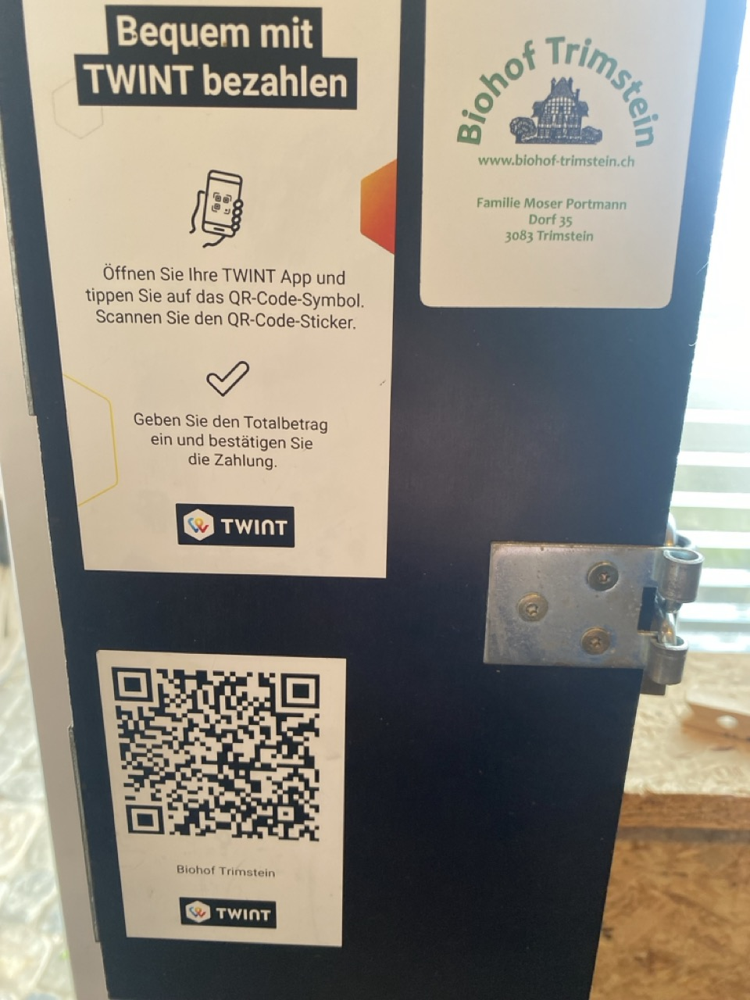

+++
title = "Die Umsetzung der Bio-Ideologie"
date = "2024-06-18"
draft = false
pinned = true
tags = ["Lilo", "Reportage"]
image = "d028e414-7385-4ffd-b72a-07e8a5dd2e70.jpg"
description = ""
footnotes = "Quelle Abbildung Blogtitel: Eigene Aufnahme\n\nQuelle Abbildung 1: Eigene Aufnahme\n\nQuelle Abbildung 2: Eigene Aufnahme\n\nQuelle Abbildung 3: Eigene Aufnahme"
+++


Die Freiheit ihres Berufes verbindet sie, und doch könnten Prinzipien ihren Alltag nicht unterschiedlicher machen. Während sie aufs Feld geht und von Hand die Bio-Erdbeeren pflückt, fährt er mit der Pestizidspritze übers Zuckerrübenfeld. 


### **Kupfer & Kompromisse**

Eine Nachbarin kommt herein, sie wird herzlich begrüsst. Wo denn die Erdbeeren seien, fragt sie und wird freundlich zum kleinen Hofladen vor dem Haus gewiesen: « Die Erdbeeren habe ich schon nach unten gebracht». Im Hofladen findet man nicht nur Erdbeeren, Karotten, Salat und noch mehr Früchte und frisches Bio-Gemüse, sondern auch selbstgemachten Bio-Tofu, Karotten-Lachs, selbstgemachter Most, diverse Hülsenfrüchte und Getreide.

Durch eine schlichte Tür geht es in die einladende Küche mit dem angrenzenden Esszimmer des schönen Bauernhauses. Der ganze Raum hat eine helle, warme Holztäfelung und über den Köpfen stützen massige Balken die Decke. An der Wand neben dem Esstisch hängt ein leerer Kartoffelsack, auf dem steht: «Mosers Biohof seit 2015».

Völlig anders als es das Klischee besagt, hat Frau Portmann zuerst studiert und dann in einem Büro gearbeitet, und erst später kam sie zu ihrem Mann auf den Hof. Sie trauere dem Bürojob kein bisschen nach, meinte sie. Durch Frau Portmann entstand die Idee den Hof auf Bio umzustellen. Der Hof verwandelte sich von einer einseitigen Milchproduktion zu einem vielseitigen Biohof mit vielen verschiedenen Produkten. Eines bleibt aber gleich: Es muss viel Arbeit auf dem familiären Hof erledigt werden. Diese Arbeit wird nebst Frau Portmanns Familie auch noch von einer Aushilfe und Lehrlingen unterstützt. Die Aufgaben sind mit einem Tages-/ und einem Wochenplan strukturiert, sie sind abwechslungsreich aufgeteilt, damit die Lernenden verschiedene Einblicke haben und alle Arbeiten einmal gemacht haben.

Eines ihrer Produkte sind Erdbeeren. Diese werden immer mit einem Regendach vor Regen, Wind und Hagel geschützt. Doch in Jahren wie in diesem ist es schlicht zu feucht, die Erdbeeren beginnen zu faulen. Um dies zu vermeiden, ist der Gebrauch von Pflanzenschutzmittel wie Kupfer, oder Kaliumkarbonat manchmal unvermeidbar. Kupfer bleibt zwar im Boden, jedoch hat es keine synthetischen Giftstoffe, die ins Trinkwasser kommen. Obwohl diese von Bio Suisse zugelassen sind, werden sie laut Frau Portmann nur eingesetzt, wenn es wirklich nicht anders ginge. Sie führt uns vor Augen, dass es immer ein Abwägen sei, ob man nun Pestizide einsetze oder nicht. «Manchmal muss Kupfer eingesetzt werden und wenn, dann nur in geringen Mengen», erläuterte Frau Portmann, «es ist der beste Kompromiss.»

### **Labels & Co.**

Ein Label ist ein Zertifikat. Es garantiert, dass die festgelegten Standards eingehalten werden. Die Kontrollen des Biolabels sind laut Frau Portmann sehr seriös. Sie kritisiert aber, dass neben dem Management auch die Biodiversität geprüft werden müsse. Bei den Kontrollen wird geschaut ob die Vorschriften eingehalten werden, z.B. das Datum beim Mähen. Jedoch werden nicht die verschiedenen Arten von Pflanzen und Blumen gezählt oder der Humusgehalt gemessen. Bei der ergebnisorientierten Kontrolle wird die Biodiversität gemessen. Das Problem dabei ist, dass auf einem benachbarten Feld vielleicht gespritzt wird, was die Diversität einschränken würde.

Der Bioanbau ist oft mit viel Handarbeit verbunden, in der brennenden Sonne beim Unkraut jäten oder wenn die Wolken aufziehen und bei Regen noch die Karotten geerntet werden müssen. Auch werden die Erdbeeren von Hand gesäubert. Dieser Aufwand macht oft einen Preisunterschied aus, denn bei der IP-Suisse Landwirtschaft ist alles viel automatisierter. Frau Portmann vertritt die Meinung, dass unsere Gesellschaft zu wenig Wert auf das Essen legt: «Wenn man beim Essen spart, muss jemand anderes den Preis dafür bezahlen sei es heute oder morgen. Wenn man die Produktionsweisen selbst erleben würde, wäre man wahrscheinlich weniger entkoppelt.» Ein konkretes Beispiel dafür ist die Milchproduktion. Wenn man nicht Bio oder Demeter einkauft, ist die Milch natürlich viel günstiger, hier bezahlen die Kühe mit ihrem Leben. Frau Portmann erklärte ein Grossteil der Konsument: innen könnten keinen Tag in solch einem Stall ausharren, weil die Bedingungen dort so schlimm seien. Viel zu viele Kühe in dem Raum, Körper an Körper, mit dem Kopf durch die Gitter zum Futtertrog. Daneben die Kühe an der Melkstation, an ihren Zitzen die Abpump-Geräte. Manche würden bei dem Anblick sofort nur noch Biomilch konsumieren oder sogar ganz auf den Milchkonsum verzichten. Doch die breite Bevölkerung sieht nicht, was hinter den Stalltüren geschieht, und will es auch nicht.

Wie schon angedeutet, gibt es mehrere Labels, die gängigsten sind Demeter, Bio Suisse und IP-Suisse. Der Bio-Suisse Standard setzt voraus, dass auf natürliche Kreisläufe und Prozesse, sowie auf Nachhaltigkeit, Biodiversität und Bodenfruchtbarkeit Rücksicht genommen wird. Damit das eingehalten werden kann, gibt es Auflagen und Kontrollen. Gemäss dem Bundesamt für Statistik sind 2023 in der Schweiz 19 Prozent aller Bauernhöfe Bio zertifiziert. Die Auflagen des Demeter Labels reichen noch weiter als die von Bio-Suisse und gelten auch weltweit.

In den Medien taucht immer wieder der Begriff konventionelle Landwirtschaft auf. Damit ist aber meistens IP-Suisse gemeint. Das führt doch zu Unklarheiten, denn in der konventionellen Landwirtschaft gelten wirklich nur die gesetzlichen Mindestanforderungen. Die IP-Suisse Vorschriften gehen deutlich weiter als das gesetzliche Minimum. Sie erlauben aber mehr Pestizide als Bio-Suisse. Das Ziel von IP-Suisse ist es, zwischen biologischer und konventioneller Landwirtschaft zu stehen.

### **Produktion & Politik**

Marcel Schott ist ein Saatgutproduzent. Alle Landwirt: innen, die Getreide anpflanzen, benötigen dieses Saatgut. Marcel Schott vermehrt Saatgut von Gerste und Weizen, welches er nach der Ernte in zwei Ladungen nach Lyss in die Annahmestelle bringt. Mit dem Traktor fährt er mit maximal 30km/h fast zwei Stunden. Dort angekommen wird das Getreide zuerst abgeladen, dann von Insekten und Schmutz gereinigt, gebeizt, also mit Pflanzenschutzmittel gegen Krankheiten und Pilze behandelt und dann abgepackt für das Saatgut im nächsten Jahr.

Der IP-Suisse Bauer besitzt 46 Hektar Land, das ist ungefähr so viel wie 64 Fussballfelder. «Ein mittlerer Betrieb», meint Marcel Schott. Ein Betrieb, der ohne Pflanzenschutzmittel weder bewältigbar noch gewinnbringend wäre. Im Jahr 2021 stehen zwei Initiativen an, nämlich die Trinkwasser-Initiative und die Initiative gegen synthetische Pestizide. Diese Initiativen sorgen für viel Aufruhr im Volk und sind sehr umstritten. Das spürt auch Marcel Schott, denn auf einigen Strassen neben den Betrieben im Seeland werden Parolen mit roter Farbe gesprayt. « Fungizid-Gift für alle», stand vor Marcel Schotts Hof. Dieses Thema war sehr durch Emotionen geprägt, auch wurden ihm auch negative Kommentare nachgerufen, als er mit der Spritze zum Feld fuhr.

Dieser Hass auf die sogenannten «Gift-Barone» verzog sich aber ziemlich rasch wieder als die Situation mit der Corona Pandemie immer kritischer wurde. Die meisten Lebensmittel, die in der Schweiz produziert werden, sind IP-Suisse zertifiziert. Mit diesem Label ist eine grössere Produktion möglich. Ohne diesen Grossanbau von Lebensmitteln, hätte sich die Schweiz noch schlechter versorgen können, als sie es ohnehin schon tat, und noch mehr hätte importiert werden müssen. Schon bald nach den Abstimmungen erlangt das Coronavirus wieder Oberhand in den Medien. Die Lebensmittelproduktion der IP-Suisse Landwirt: innen wieder wertgeschätzt, da die Lebensmittelknappheit plötzlich greifbar nahe war. Marcel Schott und viele Landwirt: innen verspürten eine Erleichterung.

Und doch ist der Umschwung in der Politik schon vor der Pandemie in vollem Gange, auch Marcel Schott bekommt dies zu spüren. 2019 wird ein Insektizid verboten, mit welchem die Zuckerrübensetzlinge umhüllt wurden. Dieses gelangte in die Zuckerrübe, wenn sie wuchs und schützte sie zuerst vor Insekten und Unkraut, danach vor Krankheiten. « Man möchte immer weniger Pflanzenschuttmittel benutzen, doch das ist kontraproduktiv: Jetzt muss ich die Zuckerrüben drei- bis viermal spritzen, statt einmal beizen.» Auch sind die Setzlinge viel schwächer und angreifbarer. Das Wachstum ist zu Beginn sehr eingeschränkt und auch die Blätter leiden sehr. Das wiederum senkt den Verkaufspreis, da dieser durch Gewicht und Zuckerhalt der Zuckerrüben bestimmt ist.

### **Die Bio-Utopie**

Für eine mehrheitlich biologische Schweizer Landwirtschaft ist es zuerst wichtig, den Import zu minimieren, die Eigenproduktion zu steigern und erst dann auf Bio umzusteigen. Mit neuen Technologien, wie beispielsweise dem vertikalen Farmen, also anbauen an Flächen von hohen Gebäuden, z.B. Hausfassaden, Balkonen und Dächern, oder genauen Bewässerungssystemen würde die landwirtschaftliche Produktivität erheblich gesteigert werden. Um Emissionen durch den Transport zu minimieren, müsste auch weitestgehend von allen regional und saisonal eingekauft werden.  Durch diese Massnahmen wäre die Schweiz in der Lage, sich weitgehend biologisch und eigenständig zu versorgen, gleichzeitig aber auch klimafreundlich und nachhaltig.

### **Zuhause im Alltag**

Wie die Nahrungsmittel hergestellt werden, ob Bio oder IP-Suisse, das Thema betrifft alle. Es existieren viele verschiedene Ansichten, Überzeugungen, was ideal und umsetzbar wäre. Dass alle Lebensmittel Bio und nachhaltig hergestellt werden, ist in der Gesellschaft noch nicht möglich. Dafür muss der Wert des Essens neu definiert werden. Das Essen sollte als ein wertvolles Gut angesehen werden, und man müsste sich im Klaren sein, dass diese Nahrungsmittel täglich zur Verfügung stehen und darüber nachdenken, woher sie kommen und wie sie produziert werden. Ideal wäre es natürlich, wenn die Produkte immer aus dem Biolädeli von nebenan kommen. Jedoch haben nicht alle die Mittel dazu, und da muss man für sich abwägen, was und wie viel man sich leisten kann. Es ist schon ein guter Schritt Richtung ökologische Landwirtschaft, wenn alle möglichst saisonal und lokal einkaufen. Oft findet man in kleinen Bioläden, frische, feine, und sogar neue Produkte, die man noch nicht kennt, wie beispielsweise den Karotten-Lachs im Hoflädeli von Katrin Portmann.

